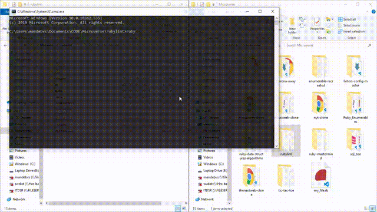
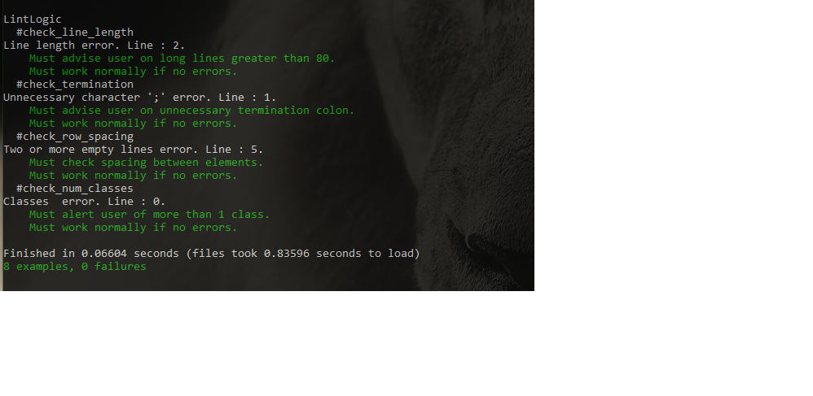

# Rubylint

- [Rubylint](#rubylint)
    - [About RubyLint](#about-rubylint)
  - [How to use](#how-to-use)
  - [Usage](#usage)
    - [Built With](#built-with)
  - [Video Presentation](#video-presentation)
  - [Potential future features](#potential-future-features)
  - [Contributors](#contributors)
  - [:handshake: Contributing](#handshake-contributing)
  - [Show your support](#show-your-support)
  - [Acknowledgements](#acknowledgements)

### About RubyLint
**_Rubylint_** is a linter for Ruby Style Guide specifications, which:

- Makes Ruby Code Readable
- Checks compliance
- Delivers early feedback for Ruby Developers
- Provides best practices and advices

## How to use 

1. Open the directory where the application is.
2. In bash/terminal type `ruby bin/main.rb <full-path-to-ruby-file-to-check>` as below.





## Usage

The **_Rubylint_** does basic syntax checking, as well as applying a set of rules to the code and throws back an error if bad syntax is found. Inspired by the ruby style guide.
The throwback error is being printed out indicating the line and column of the specific syntax issue.

**Examples**
- Spacing, not enough spacing between line items.
- Class Usage, more than one class per file.
- Line Format, unnecessary charater **';'**
- Line length error, recommended line length is 60.

To test out **Rubylint** you need to:
* have **Ruby** installed on your computer
* [download](https://github.com/simandebvu/rubylint/archive/develop.zip) or clone this repo:
  - Clone with SSH:
  ```
  git@github.com:simandebvu/rubylint.git
  ```
  - Clone with HTTPS:
  ```
  https://github.com/simandebvu/rubylint.git
  ```
* Navigate to root directory of the repo and run:
```
$ ruby bin/main path_to_file.rb (path_to_file being the file you want to check for linters)
```


### Built With
This project was built using these technologies.
* Ruby
* Rspec
* Rubocop
* VSCode :vscode:

## Video Presentation

Check out full presentation [here]([#](https://www.loom.com/share/9053a51437b84e5ab9ba49fde4735549))

## Potential future features

- Accept more Complex Syntax
- Make it an installable gem

## Contributors

👤 **Shingirayi Mandebvu**

- LinkedIn: [simandebvu](https://www.linkedin.com/in/simandebvu/)
- GitHub: [@simandebvu](https://github.com/simandebvu)
- Twitter: [@simandebvu](https://twitter.com/simandebvu)


## :handshake: Contributing
Contributions, issues and feature requests are welcome!
Feel free to check the [issues page](https://github.com/simandebvu/rubylint/issues)

## Show your support
Give a :star: if you like this project!


<!-- ACKNOWLEDGEMENTS -->
## Acknowledgements
* [Microverse](https://www.microverse.org/)
* [Ruby Documentation](https://www.ruby-lang.org/en/documentation/)